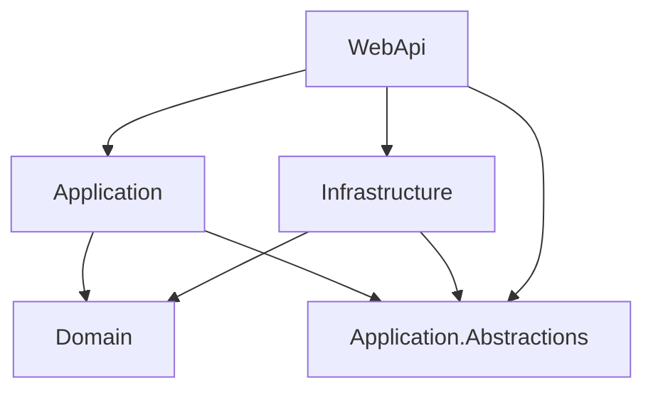

# FilmBase - Architecture Overview

This document explains the architectural decisions and project structure for the **FilmBase** Web API solution. The solution follows **Clean Architecture** principles, enforcing separation of concerns, inversion of dependencies, and maintainability.

## 🧱 Solution Structure

```
FilmBase.sln
│
├── WebApi                     // Presentation Layer (entry point)
├── Application               // Use Cases (business logic)
├── Application.Abstractions // Interfaces for Application services
├── Domain                    // Enterprise business rules
└── Infrastructure            // External implementations (e.g., DB, email, logging)
```


---

## 🧭 Project Roles & Responsibilities

### 1. **Domain**

> Contains the core business logic and entities. This project has no dependencies.

**Includes:**
- Entities (`Film`, `User`, etc.)
- Value Objects (`Email`, `Rating`)
- Domain Events
- Domain Exceptions
- Aggregates
- Interfaces (e.g., `IFilmRepository` if domain-driven)

**Rules:**
- No infrastructure or application logic.
- Only references types from `System` and other .NET BCL assemblies.

---

### 2. **Application**

> Contains application-specific business rules like use cases and orchestrates domain behavior.

**Includes:**
- Use Case Handlers (e.g., `CreateFilmCommandHandler`)
- Commands / Queries (CQRS)
- DTOs
- Validation (e.g., FluentValidation)
- Authorization Requirements

**Depends On:**
- `Domain`
- `Application.Abstractions`

**Does Not Include:**
- EF Core
- Web concerns
- File system access

---

### 3. **Application.Abstractions**

> Contracts that are implemented in other layers (e.g., Infrastructure), but used by `Application`.

**Includes:**
- Service Interfaces (e.g., `IEmailSender`, `ICurrentUserService`)
- Persistence Interfaces (e.g., `IFilmRepository`)
- Cross-cutting contracts (e.g., `ILoggerAdapter`, `IUnitOfWork`)

**Referenced By:**
- `Application`
- `Infrastructure`
- `WebApi` (if needed for things like user context)

---

### 4. **Infrastructure**

> Implements external services and persistence mechanisms.

**Includes:**
- EF Core DbContext and Migrations
- Repository implementations
- Email sender
- File storage
- Logging adapters

**Depends On:**
- `Application.Abstractions`
- `Domain`

**Referenced By:**
- `WebApi`

---

### 5. **WebApi**

> The presentation layer that exposes HTTP endpoints and handles dependency injection.

**Includes:**
- Controllers
- Filters / Middleware
- Swagger configuration
- DI container setup
- Authentication / Authorization
- Exception handling

**Depends On:**
- `Application`
- `Application.Abstractions`
- `Infrastructure`
- `Domain` (for model binding or metadata if needed)

---

## 🔁 Project References Diagram



---

## ✅ Dependency Rules

- **Domain** is the core and does **not depend on anything**.
- **Application** depends only on `Domain` and abstractions.
- **Infrastructure** depends on `Domain` and `Application.Abstractions`, never on `Application`.
- **WebApi** depends on everything else but should not contain business logic.

---

## 🛠️ Example File Allocation

| File / Class                        | Project                     |
|------------------------------------|-----------------------------|
| `Film.cs`                          | `Domain`                    |
| `RatingValueObject.cs`             | `Domain`                    |
| `CreateFilmCommand.cs`             | `Application`               |
| `CreateFilmCommandHandler.cs`      | `Application`               |
| `IEmailSender.cs`                  | `Application.Abstractions` |
| `EfFilmRepository.cs`              | `Infrastructure`           |
| `AppDbContext.cs`                  | `Infrastructure`           |
| `FilmController.cs`                | `WebApi`                    |
| `Program.cs` / `Startup.cs`        | `WebApi`                    |

---

## 📌 Notes

- **CQRS** is encouraged: separate queries and commands for clarity and scalability.
- **MediatR** is commonly used for dispatching commands and queries.
- **FluentValidation** can be used in `Application` for command/query validation.
- **Swagger** setup lives in `WebApi`.
- **Entity Framework Core** is contained within `Infrastructure`, not `Domain`.

---

## 📚 References

- [Clean Architecture – Robert C. Martin](https://8thlight.com/blog/uncle-bob/2012/08/13/the-clean-architecture.html)
- [Microsoft Docs – .NET Architecture Guides](https://docs.microsoft.com/en-us/dotnet/architecture/)